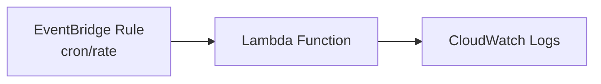
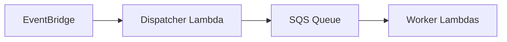
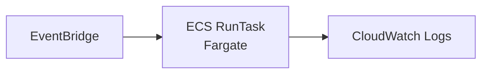

**TL;DR**

> Cron on EC2 works, but you carry unnecessary operational risk and cost. Modern AWS architectures treat time as an event source and use EventBridge, Lambda, SQS, and ECS Fargate to build reliable, scalable, pay-per-use “serverless cron” systems. These approaches eliminate OS maintenance, reduce failure modes, scale on demand, and integrate cleanly with event-driven designs. Terraform examples below demonstrate production-ready patterns that align with AWS Well-Architected guidelines—least-privilege IAM, minimal blast radius, observable pipelines, and clear separation of responsibilities.

---

## The Baseline: Cron on EC2

A typical EC2-based cron job:

```bash
0 * * * * /usr/local/bin/hourly-report.py >> /var/log/hourly-report.log 2>&1
```

This works, but it binds you to:

*   OS patching, package updates, and security hardening
*   Cron daemon availability
*   Instance sizing and scaling
*   Log management and failure detection
*   High-availability complexity if the instance dies

The job is simple; everything surrounding it is not.

---

## EventBridge Rules → Lambda

We use Amazon EventBridge Rules to trigger execution. This managed service replaces the cron daemon, while Lambda replaces the compute instance. (Note: For advanced use cases involving time zones or one-off schedules, consider the newer *EventBridge Scheduler*, though standard *EventBridge Rules* suffice for fixed recurring tasks.)



### Lambda Example

```python
import datetime

def lambda_handler(event, context):
    now = datetime.datetime.utcnow().isoformat()
    print(f"[{now}] Running hourly report")
```

### Terraform Implementation

```hcl
data "aws_iam_policy_document" "lambda_assume" {
  statement {
    effect = "Allow"
    principals {
      type        = "Service"
      identifiers = ["lambda.amazonaws.com"]
    }
    actions = ["sts:AssumeRole"]
  }
}

resource "aws_iam_role" "lambda_exec" {
  name               = "lambda-exec"
  assume_role_policy = data.aws_iam_policy_document.lambda_assume.json
}

resource "aws_iam_role_policy_attachment" "lambda_basic" {
  role       = aws_iam_role.lambda_exec.name
  policy_arn = "arn:aws:iam::aws:policy/service-role/AWSLambdaBasicExecutionRole"
}

resource "aws_lambda_function" "hourly" {
  function_name = "hourly-report"
  handler       = "lambda_function.lambda_handler"
  runtime       = "python3.11"
  role          = aws_iam_role.lambda_exec.arn
  filename      = "lambda.zip"
}

resource "aws_cloudwatch_event_rule" "hourly" {
  name                = "hourly-report"
  schedule_expression = "cron(0 * * * ? *)"
}

resource "aws_cloudwatch_event_target" "invoke_lambda" {
  rule      = aws_cloudwatch_event_rule.hourly.name
  target_id = "lambda"
  arn       = aws_lambda_function.hourly.arn
}

resource "aws_lambda_permission" "allow_scheduler" {
  statement_id  = "AllowExecutionFromEventBridge"
  action        = "lambda:InvokeFunction"
  function_name = aws_lambda_function.hourly.function_name
  principal     = "events.amazonaws.com"
  source_arn    = aws_cloudwatch_event_rule.hourly.arn
}
```

---

## Distributed Cron: EventBridge → Dispatcher → SQS → Worker Lambdas

For multi-tenant or partitioned workloads, a single scheduled event fans out jobs across many workers. A "Dispatcher" Lambda calculates work partitions and pushes messages to a queue, decoupling the schedule from the execution.



### Dispatcher Example

```python
import json, os, boto3

sqs = boto3.client("sqs")

def lambda_handler(event, context):
    tenants = ["acme", "globex", "initech"]
    for t in tenants:
        sqs.send_message(
            QueueUrl=os.environ["QUEUE_URL"],
            MessageBody=json.dumps({"tenant": t})
        )
```

### Worker Example

```python
import json

def lambda_handler(event, context):
    for record in event["Records"]:
        tenant = json.loads(record["body"])["tenant"]
        print(f"Processing tenant={tenant}")
```

### Terraform Implementation

```hcl
resource "aws_sqs_queue" "cron_tasks" {
  name = "cron-tasks"
}

resource "aws_lambda_function" "dispatcher" {
  function_name = "dispatcher"
  handler       = "dispatcher.lambda_handler"
  runtime       = "python3.11"
  role          = aws_iam_role.lambda_exec.arn
  filename      = "dispatcher.zip"
  environment {
    variables = {
      QUEUE_URL = aws_sqs_queue.cron_tasks.id
    }
  }
}

resource "aws_lambda_function" "worker" {
  function_name = "worker"
  handler       = "worker.lambda_handler"
  runtime       = "python3.11"
  role          = aws_iam_role.lambda_exec.arn
  filename      = "worker.zip"
}

resource "aws_lambda_event_source_mapping" "sqs_to_worker" {
  event_source_arn = aws_sqs_queue.cron_tasks.arn
  function_name    = aws_lambda_function.worker.arn
  batch_size       = 10
}

resource "aws_cloudwatch_event_rule" "distributed_cron" {
  name                = "distributed-cron"
  schedule_expression = "cron(0 * * * ? *)"
}

resource "aws_cloudwatch_event_target" "dispatcher_target" {
  rule      = aws_cloudwatch_event_rule.distributed_cron.name
  target_id = "dispatcher"
  arn       = aws_lambda_function.dispatcher.arn
}

resource "aws_lambda_permission" "allow_dispatcher_invocation" {
  statement_id  = "AllowExecutionFromEventBridgeDispatcher"
  action        = "lambda:InvokeFunction"
  function_name = aws_lambda_function.dispatcher.function_name
  principal     = "events.amazonaws.com"
  source_arn    = aws_cloudwatch_event_rule.distributed_cron.arn
}
```

---

## EventBridge → ECS Fargate RunTask

For containerized jobs requiring custom binaries, long runtimes, or specialized libraries, Fargate provides serverless container execution.



### Terraform Implementation

```hcl
resource "aws_ecs_cluster" "cron" {
  name = "cron-cluster"
}

resource "aws_ecs_task_definition" "task" {
  family                   = "cron-task"
  requires_compatibilities = ["FARGATE"]
  network_mode             = "awsvpc"
  cpu                      = 256
  memory                   = 512
  execution_role_arn = aws_iam_role.ecs_task_exec.arn
  task_role_arn      = aws_iam_role.ecs_task_role.arn
  container_definitions = jsonencode([{
    name      = "cron-worker"
    image     = "${aws_ecr_repository.repo.repository_url}:latest"
    essential = true
    logConfiguration = {
      logDriver = "awslogs"
      options = {
        awslogs-region        = "us-east-1"
        awslogs-group         = "/ecs/cron"
        awslogs-stream-prefix = "cron"
      }
    }
  }])
}

resource "aws_iam_role" "ecs_task_exec" {
  name = "ecs-task-exec"
  assume_role_policy = data.aws_iam_policy_document.ecs_task_assume.json
}

resource "aws_iam_role_policy_attachment" "ecs_task_exec_policy" {
  role       = aws_iam_role.ecs_task_exec.name
  policy_arn = "arn:aws:iam::aws:policy/service-role/AmazonECSTaskExecutionRolePolicy"
}

resource "aws_cloudwatch_event_rule" "fargate_cron" {
  name                = "fargate-cron"
  schedule_expression = "rate(1 hour)"
}

resource "aws_cloudwatch_event_target" "run_fargate" {
  rule      = aws_cloudwatch_event_rule.fargate_cron.name
  target_id = "fargate"
  arn       = aws_ecs_cluster.cron.arn

  ecs_target {
    task_definition_arn = aws_ecs_task_definition.task.arn
    launch_type         = "FARGATE"
    network_configuration {
      subnets         = ["subnet-123456"]
      assign_public_ip = "ENABLED"
    }
  }
}

resource "aws_iam_role" "eventbridge_ecs_invoke" {
  name = "eventbridge-ecs-invoke"
  assume_role_policy = data.aws_iam_policy_document.eventbridge_assume.json
}

resource "aws_cloudwatch_event_target" "ecs_target_role" {
  rule      = aws_cloudwatch_event_rule.fargate_cron.name
  target_id = "ecs"
  arn       = aws_ecs_cluster.cron.arn
  role_arn  = aws_iam_role.eventbridge_ecs_invoke.arn
}
```

---

## Why Serverless Architectures Surpass Cron on EC2

The shift from EC2 cron to serverless designs is driven by concrete engineering benefits.

**Operational load decreases significantly:** there is no OS to patch, no cron daemon to monitor, and no hardware lifecycle concerns. AWS handles availability of the scheduler and compute layer. This improves reliability by removing entire failure classes—machine failure, disk full, cron misconfiguration, or drifted environments.

**Scalability improves dramatically:** serverless functions and container tasks scale horizontally with demand. When a schedule generates multiple units of work, fan-out patterns allow thousands of concurrent workers without provisioning servers. Workloads that once required bespoke coordination or clusters become straightforward event-driven systems.

**Cost shifts from standing capacity to active usage:** Unlike EC2, which bills for idle time between jobs, serverless architectures bill only for the milliseconds of compute actually used. While a high-frequency loop running 24/7 might favor reserved instances, the vast majority of cron jobs—running hourly, daily, or sporadically—see costs drop by orders of magnitude.

**Security posture strengthens** because ephemeral execution environments limit long-lived credentials and reduce attack surface. Each Lambda or task receives a minimal IAM role, reducing lateral movement risks. This reduction in mutable infrastructure is also why serverless [simplifies PCI-DSS compliance](/posts/serverless-pci-dss-scope-reduction).

Finally, integrating time as an event source allows cron workflows to be treated as part of a broader event-driven architecture. Scheduled actions interact cleanly with other system events, message buses, and step-driven orchestrations, creating more modular and adaptable systems.

---

## Conclusion

Replacing EC2 cron with serverless scheduling introduces clear technical advantages across reliability, cost, operational efficiency, and architectural flexibility. EventBridge Rules combined with Lambda offers a lightweight foundation suitable for the majority of scheduled workloads. When work must be parallelized, introducing SQS and worker Lambdas provides a scalable, elastic pipeline with built-in throttling, retries, and isolation. For container-based workloads or tasks requiring extended runtimes, Fargate RunTask enables scheduled execution with strong security boundaries and without persistent infrastructure. Together, these patterns represent a modern, resilient approach to scheduled work on AWS that aligns with Well-Architected principles and sets a foundation for fully event-driven systems.

---

## Further Reading

**AWS Documentation**

*   [EventBridge Scheduler User Guide](https://docs.aws.amazon.com/eventbridge/latest/userguide/eb-scheduler.html)
*   [Using AWS Lambda with Amazon EventBridge](https://docs.aws.amazon.com/lambda/latest/dg/services-eventbridge.html)
*   [Using AWS Lambda with Amazon SQS](https://docs.aws.amazon.com/lambda/latest/dg/with-sqs.html)
*   [Scheduled Tasks in Amazon ECS](https://docs.aws.amazon.com/AmazonECS/latest/developerguide/scheduling_tasks.html)

**AWS Blog Posts**

*   [Serverless Scheduling](https://aws.amazon.com/blogs/architecture/serverless-scheduling/)
*   [Scheduling Amazon ECS Tasks](https://aws.amazon.com/blogs/containers/scheduling-amazon-ecs-tasks/)

**Infrastructure as Code**

*   [Terraform: AWS Provider Documentation](https://registry.terraform.io/providers/hashicorp/aws/latest/docs)
*   [Terraform: AWS Lambda Function Resource](https://registry.terraform.io/providers/hashicorp/aws/latest/docs/resources/lambda_function)

**Event-Driven Architecture**

*   [Event-driven architecture on AWS](https://docs.aws.amazon.com/prescriptive-guidance/latest/cloud-design-patterns/event-driven-architecture.html)
