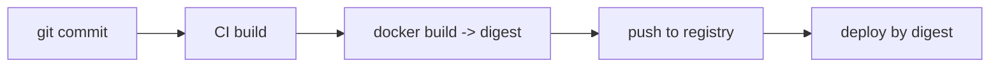

**TL;DR**

> Idempotent or fully reproducible Dockerfiles are frequently promoted as a best practice, but in most real-world engineering environments they are not the right objective. What teams actually need are: (1) immutable, traceable artifacts stored in a registry, and (2) regular CI rebuilds that continuously pick up security patches and updated dependencies. Idempotent rebuilds provide relatively little operational value when the original image artifact is preserved and addressable by digest. Reproducibility is still useful in specialized domains (regulated, research, high-assurance), but for mainstream application development it adds cost and complexity without commensurate benefit.

---

Most Docker tutorials and security guides assert that building an image “should be idempotent and reproducible”: run `docker build` repeatedly and obtain the same result. The premise sounds compelling, but it makes an assumption that is often false in container-based workflows: that teams need to recreate an old image from scratch. They generally do not. They need reliable, immutable artifacts in a registry and continuous updates during normal CI activity.

This article presents the arguments on both sides and then explains why idempotency should not be the default goal.

---

## 1. What “Idempotent Dockerfile” Actually Means

The term blends several related ideas:

- **Idempotent build:** Running `docker build` multiple times yields “the same” image.
- **Reproducible build:** Anyone can rebuild on any machine and get a bit-for-bit identical image.
- **Functional equivalence:** Even if bits differ (metadata, timestamps), the runtime behavior is effectively the same.

Dockerfiles in the wild typically hit the functional-equivalence tier, not strict idempotency, and almost never full reproducibility.

### Example Non-Idempotent Dockerfile

```dockerfile
FROM debian:stable-slim

RUN apt-get update && \
    apt-get install -y curl && \
    rm -rf /var/lib/apt/lists/*

COPY app /usr/local/bin/app
ENTRYPOINT ["/usr/local/bin/app"]
```

Rebuild this weeks later and the base image patch level or package versions may have changed. Image hashes differ. Yet this is common and often acceptable.

---

## 2. Arguments in Favor of Idempotent or Reproducible Builds

### 2.1. Eliminates CI drift and “works on my machine” phenomena

Guides emphasize pinning versions, avoiding network nondeterminism, and preventing side-effects so that the same Dockerfile produces the same image. This improves debugging and ensures collaborators see consistent results.

### 2.2. Supports scientific reproducibility

Research workflows sometimes require that exact environments be reconstruable years later. Dedicated guidance exists specifically for reproducible research Dockerfiles.

### 2.3. Aligns with certain supply-chain security narratives

Reproducible builds assist in verifying that an image corresponds precisely to a given source and detecting tampering. BuildKit and SBOM/attestation features exist for these use cases.

---

## 3. Why Idempotent Dockerfiles Are Rare in Practice

### 3.1. Common Dockerfile patterns are inherently non-deterministic

A BuildKit discussion summarizes the issue succinctly:

> “Building docker images with Dockerfile is not reproducible… most real-world cases involve package managers whose behavior is not deterministic.”

Sources of drift include:

- Floating base tags
- Time-varying package repositories
- Downloads without fixed digests
- Timestamps and metadata embedded in layers

### 3.2. Docker’s own guidance emphasizes frequent rebuilding

Docker recommends frequent rebuilds specifically to pick up security patches and improved dependencies. True idempotency requires freezing versions; continuous security requires allowing them to change.

### 3.3. Full reproducibility carries substantial operational overhead

Achieving bit-for-bit identical images often requires private mirrors, full version pinning, snapshot repositories, timestamp normalization, and controlled build environments. These add maintenance cost with limited mainstream payoff.

---

## 4. The Contrarian Position: Idempotency Should Not Be the Primary Objective

The key insight is that container workflows revolve around immutable artifacts, not rebuildability.

### 4.1. Registries already preserve what matters

Container ecosystems assume immutable images that are:

- Stored and retrievable by digest
- Traceable to build metadata, CI commit, and SBOM
- Versioned at build time, not reconstructed later

Given that the registry preserves the artifact, reproducing it by rebuilding is rarely required operationally.

### 4.2. Modern CI pipelines rely on time-varying builds

Typical pipelines look like:



The correct invariants are:

1. Every commit produces its own image.
2. Each image is stored immutably by digest.
3. Deployments and rollbacks reference the stored digest.

Whether `docker build` would produce the same digest again is irrelevant as long as the original digest is preserved.

### 4.3. Regular non-idempotent rebuilds are a security strength

Rebuilding frequently ensures patched OS packages, updated bases, and refreshed dependencies. Strict idempotency conflicts directly with security best practices.

### Example Registry-Centric Workflow

**Dockerfile** (time-varying but operationally sound):

```dockerfile
FROM python:3.12-slim

RUN apt-get update && \
    apt-get install -y --no-install-recommends curl && \
    rm -rf /var/lib/apt/lists/*

WORKDIR /app
COPY pyproject.toml poetry.lock ./
RUN pip install --no-cache-dir poetry && poetry install --no-interaction --no-ansi

COPY . .
CMD ["poetry", "run", "myapp"]
```

**CI Build:**

```bash
COMMIT_SHA=$(git rev-parse --short HEAD)

docker build \
  -t registry.example.com/myapp:${COMMIT_SHA} \
  -t registry.example.com/myapp:main \
  .

docker push registry.example.com/myapp:${COMMIT_SHA}
docker push registry.example.com/myapp:main

DIGEST=$(docker inspect --format='{{index .RepoDigests 0}}' \
  registry.example.com/myapp:${COMMIT_SHA})

echo "Built image: ${DIGEST}"
```

Operational correctness is guaranteed by:

- Recording and deploying by digest
- Preserving every produced artifact
- Rebuilding regularly for continuous freshness

Idempotent rebuilds are unnecessary.

---

## 5. When Reproducibility Is Needed

Idempotency and reproducibility matter in:

- Regulated or high-assurance supply chains
- Scientific workflows requiring exact rerun environments
- Air-gapped environments where rebuilding is the only allowed option

For these, specialized approaches are appropriate:

- BuildKit reproducible-build settings, `SOURCE_DATE_EPOCH`, deterministic timestamps
- Functional build systems (Nix, Bazel) for deterministic dependency graphs
- Pinned-version repositories or snapshot mirrors

These cases are the exception, not the norm.

---

## 6. A Useful Layered Model

Think of container build correctness across three layers:

1. **Runtime behavior:** The container behaves predictably when run.
2. **Artifact immutability:** The registry stores immutable digests with provenance.
3. **Build reproducibility:** Rebuilding the Dockerfile yields identical output.

Layer 1 and 2 matter universally. Layer 3 matters only in specialized contexts. Optimizing for artifact immutability and regular updates often delivers far more value than enforcing strict idempotency.

---

## 7. Practical Recommendations

1. Deploy by digest to ensure immutability.
2. Rebuild frequently in CI to pick up security and dependency updates.
3. Embed provenance via labels, SBOM, and attestation metadata.
4. Apply reproducibility only where justified, not universally.
5. Treat the registry artifact as the ground truth, not the build function.

---

## References (URLs)

- https://docs.docker.com/build/building/best-practices/
- https://codefresh.io/blog/docker-anti-patterns/
- https://www.qovery.com/blog/best-practices-and-tips-for-writing-a-dockerfile
- https://pmc.ncbi.nlm.nih.gov/articles/PMC7654784/
- https://github.com/moby/buildkit/discussions/2358
- https://docs.docker.com/build/ci/github-actions/reproducible-builds/
- https://lists.reproducible-builds.org/pipermail/rb-general/2023-October/003103.html
- https://docs.docker.com/dhi/core-concepts/immutability/
- https://www.aquasec.com/cloud-native-academy/container-security/container-images/
- https://www.docker.com/blog/docker-best-practices-using-tags-and-labels-to-manage-docker-image-sprawl/
- https://snyk.io/blog/10-docker-image-security-best-practices/
- https://snyk.io/blog/best-practices-to-build-java-containers-with-docker/
- https://medium.com/@rodolphototti/security-and-best-practices-on-making-container-images-8ee8fdee1cc2
