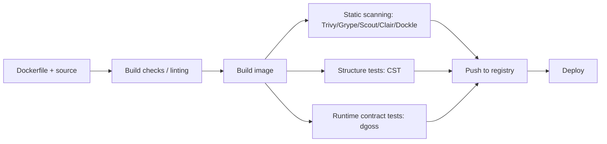

**TL;DR**

> Most Docker image “validation” happens either before the image exists (Dockerfile linting/build checks) or without running it (CVE/config scanning, image structure tests). That leaves a practical gap: asserting the built image behaves like the intended runtime environment—ports listening, processes running, files present, endpoints responding. **dgoss** (a Docker-focused wrapper around **Goss**) fills that gap by turning a built image into a testable, repeatable contract in CI/CD.

---

## The Gap: Testing Images as Files vs. Runtimes

A Docker image is both:

- a **software artifact**, and
- a **packaged operating environment**.

Many pipelines test the former, and under-test the latter.

In practice, failures that escape linting/scanning/structure checks are often **runtime contracts** that only show up after the container starts and the entrypoint runs under real timing, UID/GID, and network conditions:

- The service listens on the wrong interface/port.
- A “non-root” switch breaks file permissions.
- Required runtime files are missing or have the wrong ownership.
- A readiness condition takes time (migrations, cache warmup), and downstream tests race it.

These are not “security scanning” problems and not “Dockerfile correctness” problems—they’re **post-build behavioral contracts**.

This is precisely where **Goss** (server validation) and **dgoss** (Docker wrapper) become valuable.

> **Runtime contract (definition):** the minimum set of externally observable behaviors your container must satisfy at startup and during “steady state” to be considered shippable—e.g., which ports listen, which processes run, which files exist with usable permissions, and which readiness/health endpoints respond.

---

## The Validation Toolbox: What Each Layer Proves

Think of validation as moving from **specification → artifact → running system**. Each tool family gives confidence about one slice.

---

## 1. Build Intent (Pre-Image)

- **Docker Build checks**: built-in checks that statically analyze your Dockerfile/build configuration for common problems. Run via `docker build --check .` (availability and exact behavior depends on your Docker/Buildx version; see [Docker Build checks](https://docs.docker.com/build/checks/) and the [build-checks reference](https://docs.docker.com/reference/build-checks/)).
- **Hadolint**: Dockerfile linter (AST-based) with ShellCheck integration for `RUN` shell. See [Hadolint](https://github.com/hadolint/hadolint).
- **Policy-as-code (Conftest/OPA)**: codifies organizational rules (e.g., “no `latest` tags”, “must set `USER`”, “no `apt-get upgrade`”). Powerful for governance, but it validates inputs and metadata—not runtime behavior.

**What this layer proves:** The recipe looks sane and compliant.\
**What it cannot prove:** The resulting image runs correctly.

---

## 2. Composition & Security (Static Post-Build)

- **Trivy**: vulnerability scanning across OS and language packages and other targets. See [Trivy](https://github.com/aquasecurity/trivy).
- **Grype**: scans images, filesystems, and SBOMs for known vulns. See [Grype](https://github.com/anchore/grype).
- **Docker Scout**: analyzes composition/vulnerabilities and can “recalibrate” as vuln data changes. See [Docker Scout docs](https://docs.docker.com/scout/).
- **Clair / Anchore Engine / Dockle**:
  - **Clair**: static vuln analysis commonly used in registries. See [Clair](https://github.com/quay/clair).
  - **Anchore Engine**: centralized inspection/analysis/certification service. See [Anchore Engine](https://github.com/anchore/anchore-engine).
  - **Dockle**: lints images for security best practices. See [Dockle](https://github.com/goodwithtech/dockle).

**What this layer proves:** The artifact is not obviously unsafe or non-compliant.\
**What it cannot prove:** The container actually starts and serves traffic.

---

## 3. Structure Tests (Static Assertions)

- **Container Structure Test (CST)**: validates filesystem contents, image metadata, and command output; explicitly positioned as structure validation. See [Container Structure Test](https://github.com/GoogleContainerTools/container-structure-test) (currently in maintenance mode).

**What this layer proves:** The image contains expected files/labels/entrypoint/command outputs.\
**What it can still miss:** Lifecycle-dependent behavior (startup ordering, readiness timing, transient failure modes).

---

## Introducing dgoss: Declarative Runtime Validation

### What dgoss is

- **Goss**: YAML-based server validation (processes, ports, files, HTTP endpoints, commands, users, and more).
- **dgoss**: a wrapper aimed at testing Docker containers; the common operations are `edit` and `run`.

A useful mental model: dgoss orchestrates Docker to start a container from your image and execute goss checks against it (commonly by running the goss binary inside the container under test).

A particularly useful dgoss behavior: if `goss_wait.yaml` exists, dgoss will wait until those conditions pass before running the main tests—handy for explicit readiness gates.

### Why dgoss belongs in CI/CD

- It tests the **built image** (not your repo checkout) as a black-box runtime. Whether you deploy to [Kubernetes or a proprietary container service](/posts/kubernetes-vs-proprietary-container-services) like ECS/Fargate, dgoss validates that your image meets its runtime contract before any orchestration platform runs it.
- Assertions are **declarative**, versionable, and reviewable.
- It fails fast on issues that otherwise show up only **after deploy**.

---

## Hands-On: Validating a Built Image

### Goal

Build an image that serves a file over HTTP on port 8080 as a non-root user—and validate it with dgoss.

### Files

**Dockerfile**

```dockerfile
FROM python:3.12-alpine

RUN addgroup -S app && adduser -S -G app -h /app app
WORKDIR /app

COPY index.html /app/index.html

EXPOSE 8080
USER app

CMD ["python", "-m", "http.server", "8080", "--bind", "0.0.0.0", "--directory", "/app"]
```

**index.html**

```text
Hello from image-under-test
```

**goss.yaml**

```yaml
port:
  tcp:8080:
    listening: true

process:
  python3:
    running: true

file:
  /app/index.html:
    exists: true
    contains:
      - "Hello from image-under-test"

# Security hardening: assert the container isn't running as root (uid 0).
command:
  "sh -c 'test \"$(id -u)\" -ne 0'":
    exit-status: 0

http:
  http://localhost:8080/index.html:
    status: 200
    timeout: 30000
    body: ["Hello from image-under-test"]
```

---

## Running dgoss Locally

### Install goss + dgoss

Goss provides an installer that installs both `goss` and `dgoss`:

```bash
curl -fsSL https://goss.rocks/install | sh
```

### Build and test

```bash
docker build -t image-under-test:local .
dgoss run image-under-test:local
```

**Expected outcome:** dgoss starts a container, runs the assertions, and exits non-zero if any contract fails.

---

## Explicit Readiness Gates

If your container needs time (migrations, warmup), add a wait file:

**goss_wait.yaml**

```yaml
http:
  http://localhost:8080/index.html:
    status: 200
    timeout: 30000
```

When `goss_wait.yaml` exists, dgoss will wait for these preconditions before executing the main suite.

---

## Pipeline Context: Where dgoss Fits



Interpretation:

- Tools like Build checks and Hadolint reduce bad builds early.
- Scanners reduce known-risk content in the artifact.
- **dgoss asserts the running container matches expectations** (the gap).

---

## CI Strategy: Testing the Shippable Artifact

### Option A: Install dgoss in the CI runner

Minimal moving parts, but you manage tooling versions.

### Option B: Run dgoss from a container (common in CI)

The `praqma/dgoss` image bundles goss/dgoss and is commonly used by mounting the Docker socket plus goss files.

Example:

```bash
docker run --rm \
  -v "$PWD/goss.yaml:/goss.yaml" \
  -v /var/run/docker.sock:/var/run/docker.sock \
  -e GOSS_FILES_STRATEGY=cp \
  praqma/dgoss dgoss run image-under-test:local
```

> `GOSS_FILES_STRATEGY=cp` corresponds to a “copy files into container” strategy (implemented via `docker cp`). It’s a practical default in CI, but be aware you’re granting the container access to the Docker daemon via the socket mount.
>
> Mounting `/var/run/docker.sock` effectively grants the container **root-equivalent control** of the host’s Docker daemon. If you use this pattern, prefer isolated/ephemeral CI runners, pin the dgoss image by digest, and treat the job as highly privileged. If you can, prefer Option A (install dgoss in the runner) to avoid Docker socket mounting entirely.
{.aside}

---

## Trade-offs: What dgoss Is (and Isn’t)

### Strengths

- **Targets runtime truth**: ports/processes/files/HTTP checks catch misconfigurations static tools cannot.
- **Declarative acceptance gates**: reviewable YAML, easy to standardize across services.
- **Readiness as code**: `goss_wait.yaml` replaces flaky `sleep 10` steps with explicit conditions.

### Limits

- **Not a vulnerability scanner**: pair it with Trivy/Grype/Scout/Clair.
- **Not a full integration test harness**: it won’t replace multi-service workflows, data-plane correctness tests, or performance characterization.
- **Requires a runnable context**: if your image needs special runtime dependencies (kernel features, device mounts), your dgoss environment must approximate production.

### dgoss vs. Container Structure Test (CST)

- CST is excellent for “does the image contain X / metadata Y / command output Z”, but it is a structure validation tool and currently in maintenance mode.
- dgoss is better when the failure mode emerges only **after container start** and during readiness/runtime.

A pragmatic pipeline often uses both: **CST for structural invariants, dgoss for runtime contracts**.

---

## Conclusion

Effective container image validation is layered: build-time checks and Dockerfile linting reduce mistakes before an image exists, vulnerability and configuration scanners assess static risk in the finished artifact, and structure tests confirm expected files and metadata. Yet these layers still leave a common failure mode unaddressed—whether the built image, when run, satisfies the runtime contract you intend to ship.

By adding dgoss to your pipeline, you encode that runtime contract as declarative, repeatable assertions against the running container (ports, processes, files, and basic HTTP health), and you can gate promotion on explicit readiness conditions instead of brittle sleeps.

Start with a small, high-signal suite (a handful of checks that capture what would otherwise become runtime surprises), run it on the exact image you’re about to publish, and keep it alongside your Docker changes so the contract evolves with the artifact.

---

## Further Reading

- [Docker Build checks documentation](https://docs.docker.com/build/checks/)
- [Docker build checks reference](https://docs.docker.com/reference/build-checks/)
- [Hadolint](https://github.com/hadolint/hadolint)
- [Trivy](https://github.com/aquasecurity/trivy)
- [Grype](https://github.com/anchore/grype)
- [Docker Scout docs](https://docs.docker.com/scout/)
- [Clair](https://github.com/quay/clair)
- [Dockle](https://github.com/goodwithtech/dockle)
- [Container Structure Test](https://github.com/GoogleContainerTools/container-structure-test)
- [Goss documentation](https://goss.readthedocs.io/)
- [CircleCI example: testing Docker images with Goss](https://circleci.com/blog/testing-docker-images-with-circleci-and-goss/)
