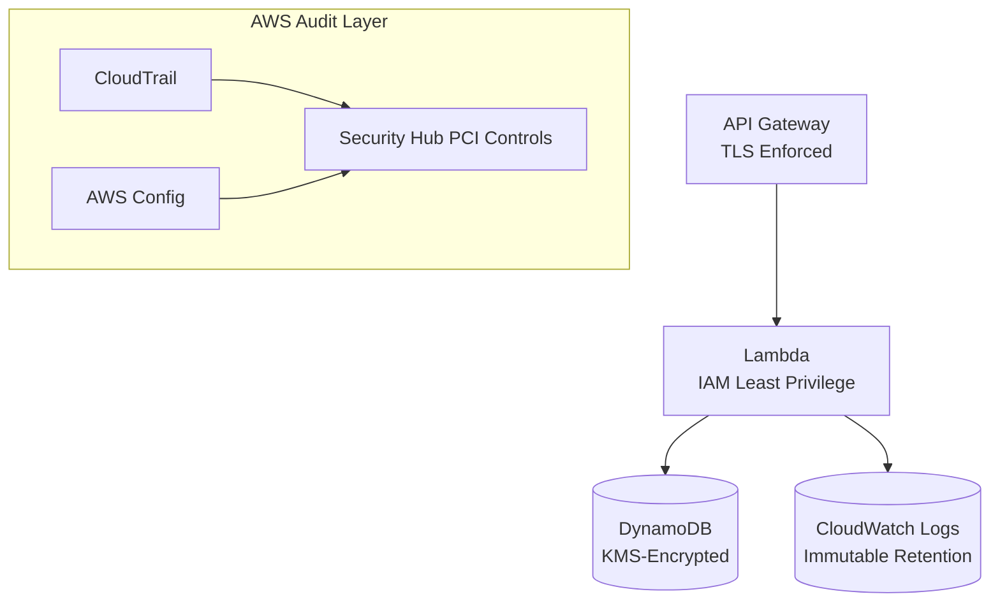

**TL;DR**

> Serverless compute (AWS Lambda, AWS Fargate) significantly reduces PCI-DSS scope because it eliminates infrastructure layers that normally require patching, monitoring, and audit evidence. Compliance becomes primarily a configuration problem (IAM, encryption, data flows) instead of an operational one (OS hardening, FIM agents, server patch cycles). The result is fewer mutable systems, fewer controls to satisfy, stronger invariants, and simpler auditor narratives. Serverless does not remove all responsibilities, but it transforms them into static, testable, automatable configurations.

---

## The Problem: Compliance Is a Systems Issue, Not a Paperwork Issue

PCI-DSS applies to systems that store, process, transmit, or can affect cardholder data.

Self-hosted stacks (EC2, VMs, Kubernetes, on-prem) expose every layer—OS, filesystem, patching, user access, network stack—into PCI scope. Every layer must be hardened, monitored, logged, and proven to auditors.

The question:

**Can serverless architectures reduce PCI burden without reducing security or flexibility?**

Yes. They do so by removing the infrastructure layers to which PCI controls attach.

---

## Core Insight: Compliance Scope Shrinks as Infrastructure Disappears

When AWS owns the OS, hypervisor, and patch cycle, those components leave your PCI scope.

Your responsibilities collapse toward the application and data boundaries.

This architectural shift—not audit strategy—is what drives scope reduction.

---

## Example: PCI Requirement 11.5 (File Integrity Monitoring)

PCI 11.5 requires detection of unauthorized changes to critical system files.

**In self-hosted environments:**

You must deploy and maintain:

- FIM agents
- Host-level logging
- Tamper-resistant configurations
- Patch management
- Evidence of correct agent behavior throughout the year

**With serverless:**

**Lambda:**

- No mutable filesystem (code at `/var/task` is read-only)
- No SSH access
- Execution environment replaced frequently

**Fargate:**

- Can run with a read-only root filesystem (via `readonlyRootFilesystem: true`)
- Container image is the only mutable artifact
- No host-level access

Because the underlying surfaces cannot drift, the PCI control becomes satisfied structurally rather than operationally.

---

## Reference Architecture: Serverless Tokenization API



**Characteristics:**

- No inbound access to compute
- Automatic TLS and request validation
- No server patching or OS controls
- Centralized audit logging
- Encrypted persistent stores
- Deterministic IAM-based access control

---

## Example Code: Minimal Lambda Tokenizer

```python
import hashlib
import os

def handler(event, context):
    pan = event["pan"]               # Provided from PCI-scoped upstream

    if not pan.isdigit():
        raise ValueError("Invalid PAN")

    # Salted token generation (never log sensitive data)
    # Note: In production, fetch secrets from AWS Secrets Manager
    salt = os.environ["TOKEN_SALT"]
    token = hashlib.sha256(f"{salt}:{pan}".encode()).hexdigest()[:16]

    return {"token": token}
```

Deployable via:

```bash
aws lambda create-function \
  --function-name tokenize \
  --role arn:aws:iam::<acct>:role/tokenizer \
  --runtime python3.12 \
  --handler handler.handler \
  --zip-file fileb://function.zip
```

No OS-level controls.
No patch lifecycle.
No host-based monitoring tools.
Only application logic and IAM.

---

## Quantitative Reduction in Mutable Surfaces

**Self-hosted**

| Component | Infrastructure Mutable? | OS/Patching Scope? |
| :--- | :--- | :--- |
| EC2 host | Yes | Yes |
| OS | Yes | Yes |
| Reverse proxy | Yes | Yes |
| Runtime/deps | Yes | Yes |
| Application | Yes | Yes |
| Database server | Yes | Yes |
| Block storage | Yes | Yes |

**Total mutable surfaces: 7**

**Serverless**

| Component | Infrastructure Mutable? | OS/Patching Scope? |
| :--- | :--- | :--- |
| API Gateway | No | No |
| Lambda runtime | No | No |
| Lambda code | Yes | Yes |
| DynamoDB | No | No |

**Total mutable surfaces: 1**

This reduction directly correlates to reductions in:

- Audit complexity
- Operational risk
- Compensating controls
- Security variability

---

## Real Constraints and Their Mitigations

Serverless simplifies compliance, but introduces different engineering considerations.

**Constraints**

1. Less OS-level introspection
2. Cold starts (Lambda) and provisioning latency (Fargate)
3. IAM becomes the primary boundary; misconfigurations become more impactful
4. Multi-service architectures increase data-flow documentation requirements
5. Incident response relies entirely on logs and metrics

**Mitigations**

- Use X-Ray + structured logging (Lambda Powertools)
- Use AWS Config + Security Hub PCI rules for continuous checks
- Enable read-only filesystems in Fargate
- Use ECR image scanning and dependency scanning (Inspector)
- Validate IAM boundaries using IAM Access Analyzer

---

## Conceptual Shift: Compliance Becomes a Configuration Problem

Traditional infrastructures are dominated by operational drift: patch cycles, misconfigurations, agent failures, and changes made under pressure. These dynamics produce a large compliance burden.

Serverless eliminates most of this drift by turning infrastructure into centrally managed, immutable, declaratively configured services. When infrastructure behaves like software, compliance becomes repeatable, reviewable, and testable.

---

## Conclusion

Serverless architectures change the nature of PCI-DSS compliance by removing the infrastructure layers that traditionally generate the bulk of operational and audit complexity. Instead of managing OS hardening, patch cycles, file integrity agents, and host-level access controls, teams focus on IAM design, encryption, data flows, and minimal application logic. This shift reduces mutable surfaces by an order of magnitude, strengthens security invariants, and simplifies the story auditors must evaluate.

The most important structural change is not cost reduction or developer ergonomics—though both are real—but the transformation of compliance from a continuous operational burden into a predominantly static configuration problem. With serverless, AWS provides a hardened, validated foundation, and teams inherit controls rather than re-implement them. This makes PCI compliance faster to achieve, easier to maintain, and more robust in practice.

As organizations modernize regulated workloads, serverless offers a compelling path forward: stronger security, smaller scope, and a compliance posture that is easier to reason about and automate. In high-assurance environments like PCI-DSS, the architectural benefits of managed services become strategic advantages.

---

## Further Reading

**AWS PCI Compliance Resources**

- [AWS PCI Compliance Overview](https://aws.amazon.com/compliance/pci-dss-level-1-faqs/)
- [AWS Services in Scope for PCI DSS](https://aws.amazon.com/compliance/services-in-scope/)
- [AWS Artifact (retrieve AWS’s PCI DSS Attestation of Compliance)](https://aws.amazon.com/artifact/)

**Serverless Security & Architecture**

- [AWS Lambda Security Overview](https://docs.aws.amazon.com/lambda/latest/dg/lambda-security.html)
- [AWS Fargate Security Overview](https://docs.aws.amazon.com/AmazonECS/latest/userguide/fargate-task-security.html)
- [AWS Well-Architected Serverless Lens](https://docs.aws.amazon.com/wellarchitected/latest/serverless-applications-lens/)

**PCI-DSS Guidance**

- [PCI DSS v4.0 Standard](https://www.pcisecuritystandards.org/document_library)
- [PCI SSC Cloud Guidance](https://www.pcisecuritystandards.org/pdfs/PCI_DSS_v3-2-1_Cloud_Guidelines.pdf)

**Case Studies**

- [Discover: PCI-Compliant Payments on AWS](https://aws.amazon.com/solutions/case-studies/discover-financial-services/)
- [FICO: Regulated Workloads on AWS Lambda](https://aws.amazon.com/solutions/case-studies/fico/)
- [Change Technologies: Achieving PCI DSS Level 1 Using Serverless](https://aws.amazon.com/blogs/security/transforming-transactions-streamlining-pci-compliance-using-aws-serverless-architecture/)
