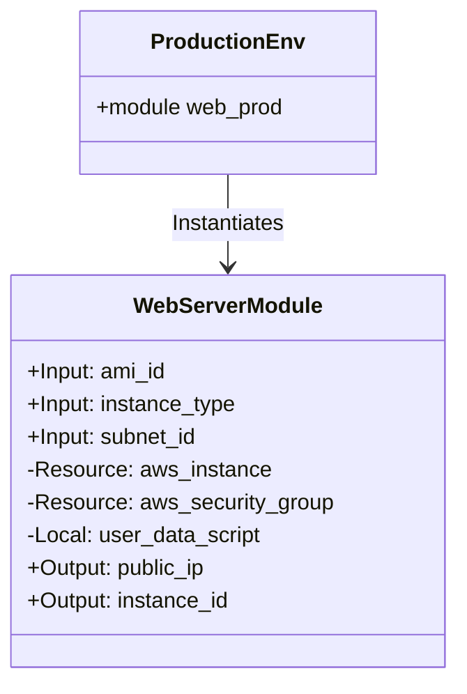
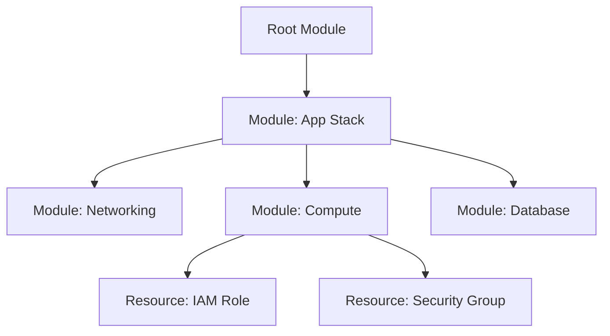

### TL;DR

>  * **The Problem:** Terraform codebases often suffer from "sprawl"—copy-pasted resources, tight coupling, and leaky abstractions that make scaling painful.
>  * **The Solution:** Treat Terraform Modules as **Classes** and Module Instances as **Objects**.
>  * **Key Mapping:**
>      * **Class** → Child Module
>      * **Object** → `module` block (instantiation)
>      * **Interface** → `variables.tf` (inputs) and `outputs.tf` (getters)
>      * **Private State** → `locals` and internal resources
>  * **Best Practice:** Prefer **Composition** (building modules from other modules) over inheritance. Use **Dependency Injection** by passing resource IDs (e.g., `vpc_id`) rather than looking them up internally with `data` sources.

-----

An Object-Oriented approach to Terraform transforms messy, repetitive HCL into a scalable infrastructure architecture. By mapping OOP principles—Encapsulation, Abstraction, Composition, and Polymorphism—to Terraform modules, we can build infrastructure that is as maintainable and testable as application code.

## The Problem: The Monolithic Terraform File

In the early days of a project, a single `main.tf` file is convenient. But as infrastructure grows, this "scripting" mindset leads to fragility. You might see hardcoded values repeated across environments, security groups defined inline with instances, and a complete lack of reusability.

When we treat Terraform purely as a configuration script, we miss the structural benefits of software engineering design patterns. We need to shift from *writing scripts* to *architecting objects*.

## The Core Analogy: Modules as Classes

The fundamental unit of OOP is the Class. In Terraform, this role is filled by the **Module**.

| OOP Concept | Terraform Implementation | Role |
| :--- | :--- | :--- |
| **Class Definition** | `./modules/web_server/` | The blueprint. Defines *how* to build something, not *what* to build. |
| **Constructor** | `variables.tf` | Defines the required inputs to instantiate the class. |
| **Public Methods/Properties** | `outputs.tf` | Defines the data explicitly exposed to the caller. |
| **Private Members** | `locals`, `resource` | Internal logic and state hidden from the parent scope. |
| **Object Instance** | `module "web_prod" { ... }` | A specific realization of the blueprint. |
{.no-wrap-col-1, .no-wrap-col-2}

### Visualization: The Module Interface

We can visualize a Terraform module exactly like a class in a UML diagram.



-----

## 1\. Encapsulation: Hiding the Mess

**OOP Principle:** Hide internal complexity and state; expose only what is necessary.

**Terraform Application:**
A consumer of your module should not need to know that you are using three separate `aws_route53_record` resources to achieve a specific failover routing policy. They should only provide the domain name.

**Anti-Pattern (Leaky Abstraction):**
Creating a module that just passes variables through to a resource 1:1.

```hcl
# BAD: This is just a wrapper. It adds no value.
module "s3_bucket" {
  source = "./modules/s3"
  bucket = "my-bucket"
  acl    = "private"
  versioning = { enabled = true }
  # ... passing every single S3 argument
}
```

**Refactored (Encapsulated Service):**
Create a "Service Module" that enforces company standards (like encryption and logging) automatically.

```hcl
# GOOD: The implementation details (encryption, logging) are encapsulated.
# The user only supplies the intent.
module "secure_storage" {
  source      = "./modules/secure_bucket"
  bucket_name = "finance-logs"
  environment = "prod"
}
```

Inside `./modules/secure_bucket`, we enforce the mandatory security settings (`private` logic), ensuring every instance of this "Class" adheres to compliance standards without the user needing to remember them.

## 2\. Dependency Injection: Decoupling Modules

**OOP Principle:** Classes should receive their dependencies rather than creating or finding them globally.

**Terraform Application:**
A common mistake is using `data` sources inside a child module to look up network information. This couples the module to a specific environment naming convention.

**Anti-Pattern (Hardcoded Dependency):**

```hcl
# /modules/app/main.tf
# BAD: The module relies on a hardcoded lookup logic.
data "aws_subnet" "selected" {
  vpc_id = "vpc-123456" # Hardcoded ID!
  filter {
    name   = "tag:Tier"
    values = ["App"]    # Hardcoded assumption about tagging!
  }
}

resource "aws_instance" "app" {
  subnet_id = data.aws_subnet.selected.id
  # ...
}
```

**Refactored (Dependency Injection):**
Pass the ID as a variable. The *caller* is responsible for knowing the context.

```hcl
# /modules/app/variables.tf
variable "subnet_id" {
  description = "The subnet ID where the app will be deployed"
  type        = string
}

# /live/prod/main.tf (The Caller)
module "app" {
  source    = "../../modules/app"
  subnet_id = module.vpc.public_subnets[0] # Injecting the dependency
}
```

## 3\. Composition: The "Has-A" Relationship

**OOP Principle:** Favor Composition over Inheritance. Build complex objects by combining simpler ones.

**Terraform Application:**
Terraform does not support inheritance (`extends`). You cannot subclass a module. Instead, you build **Composite Modules**.

Imagine a standard application stack. Instead of one massive file, you create an `app_stack` module that *composes* smaller, single-responsibility modules.



### Code Example: Composition

The `app_stack` module acts as a facade, orchestrating the interaction between the network and the compute layer.

```hcl
# /modules/app_stack/main.tf
module "networking" {
  source = "../networking"
  cidr   = var.cidr
}

module "compute" {
  source    = "../compute"
  subnet_id = module.networking.private_subnet_id # Wiring components together
  vpc_id    = module.networking.vpc_id
}
```

## 4\. Abstraction & Reuse: The "Interface" Behavior

**OOP Principle:** Objects can behave differently based on their context or configuration (Polymorphism).

**Terraform Application:**
While Terraform lacks strict inheritance-based polymorphism, we achieve similar flexibility through **Feature Toggles** and **Dynamic Blocks**.

A single module can be instantiated to behave differently—creating a full high-availability cluster in `prod` or a single instance in `dev`—simply by passing different input variables that drive `dynamic` blocks or conditional logic.

```hcl
# /modules/app/main.tf
# Polymorphic behavior: The shape of the infrastructure changes based on input.

variable "enable_load_balancer" {
  type    = bool
  default = false
}

resource "aws_lb_target_group" "app" {
  count = var.enable_load_balancer ? 1 : 0
  # ...
}

resource "aws_autoscaling_group" "app" {
  # ...
  target_group_arns = var.enable_load_balancer ? [aws_lb_target_group.app[0].arn] : []
}
```

Here, the module acts polymorphically. To the caller, it's just an "App Module", but under the hood, it morphs its structure based on the environment it lives in.

-----

## Conclusion

Treating Terraform through the lens of OOP moves you from "writing config" to "engineering systems."

1.  **Modules are Classes:** Treat them as blueprints with strict inputs and outputs.
2.  **Encapsulate Logic:** Don't let implementation details leak into the root module.
3.  **Inject Dependencies:** Pass IDs down; don't look them up laterally.
4.  **Compose, Don't Inherit:** Build large infrastructure by wiring together small, focused modules.

By respecting these boundaries, your Terraform code becomes testable, reusable, and significantly easier to refactor.

## Further Reading

  * [Terraform: Module Composition](https://developer.hashicorp.com/terraform/language/modules/develop/composition) - HashiCorp's official guide on composing modules.
  * [Refactoring Terraform](https://www.google.com/search?q=https://www.hashicorp.com/resources/refactoring-terraform-modules) - Strategies for breaking monoliths into modules.
  * [The SOLID Principles of IaC](https://www.google.com/search?q=https://itnext.io/solid-principles-for-infrastructure-as-code-85e825420377) - A deeper dive into S.O.L.I.D. applied to DevOps.