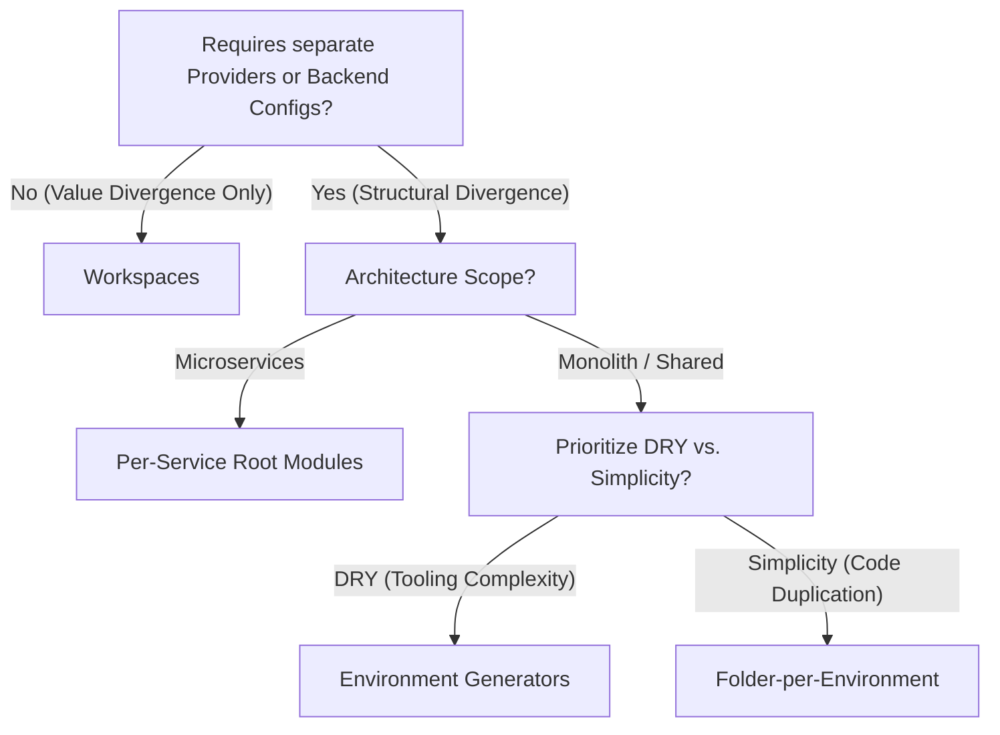

**TL;DR**

> *   Terraform structures must match the type of divergence across environments: value-based (sizes, counts) or structural (providers, topology, IAM boundaries).
> *   Folder-per-environment is safe and explicit but risks drift without strong module discipline.
> *   Workspaces support value-based differences but are operationally weak for structurally divergent or highly isolated environments.
> *   Per-service root modules scale best in microservice organizations.
> *   Service-aligned workspaces offer a hybrid approach but carry operational risks.
> *   Environment generators (Terragrunt/codegen) provide maximal parity and DRYness but add tooling complexity.
> *   Environment parity is achieved through module logic, not directory layout.

---

Terraform becomes difficult to manage as teams introduce multiple microservices and long-lived environments like dev, staging, and prod. A sustainable Terraform architecture balances:

*   Environment parity
*   Strong isolation
*   Service-level autonomy
*   DRY logic
*   Support for divergence
*   Predictable promotion flows

Choosing the right pattern is primarily about understanding the nature of your environment differences and the structure of your engineering organization.

---

## 1. Best Practices

### 1. Strong State Isolation
Dev operations must be structurally incapable of impacting prod.

### 2. Minimize Blast Radius
Decompose monolithic state files. Smaller root modules ensure that a bad `apply` in one service cannot accidentally destroy resources in another.

### 3. DRY Logic Through Modules
All environment logic should live in modules to prevent drift.

### 4. Maintain Environment Parity Where Required
Staging and prod should behave equivalently except for intended differences.

### 5. Support Intentional Divergence
Differences must be expressed cleanly, either as variables or structural changes.

### 6. Predictable Promotion Workflows
Promotion paths should be deterministic and low risk.

These practices drive the evaluation of the Terraform patterns below.

---

## 2. Value Divergence vs. Structural Divergence

A critical distinction for choosing a pattern:

**Value Divergence**
Differences in parameters: instance size, feature flags, scaling limits.
Workspaces handle these well.

**Structural Divergence**
Differences in topology, provider configurations, IAM boundaries, backends, or additional resources.
Workspaces struggle here because they share a single `main.tf` and `provider` configuration. If `dev` requires an AWS Provider in Account A and `prod` requires Account B, Workspaces require complex conditional logic. Folder-based layouts handle this natively by having distinct provider blocks for each environment.

*   **Critical Example:** If `dev` lives in AWS Account A and `prod` in AWS Account B, the Terraform `provider` block often needs distinct configurations (e.g. allowed account IDs). Workspaces share a single `main.tf` and `provider` block, making multi-account deployments brittle or hacky. Folder-based layouts handle this natively.

This distinction explains why patterns differ more than expressiveness alone would suggest.

---

## 3. Terraform Architectural Patterns

### A. Folder-per-Environment

```text
infra/
  modules/
    app/
      main.tf
      variables.tf
      outputs.tf
  envs/
    dev/
      main.tf
      backend.tf
      variables.tf
    staging/
      main.tf
      backend.tf
      variables.tf
    prod/
      main.tf
      backend.tf
      variables.tf
```

**Pros**
*   Strong isolation
*   Clear boundaries
*   Simple CI/CD setup
*   Explicit divergence

**Cons**
*   Potential for configuration drift
*   Folder duplication
*   Less ergonomic for ephemeral environments

**Example**
`envs/prod/main.tf`:
```hcl
module "app" {
  source        = "../../modules/app"
  instance_size = "m5.large"
  environment   = "prod"
}
```

---

### B. Single Root Module + Workspaces

```text
infra/
  main.tf
  variables.tf
```

**Pros**
*   High parity
*   Very DRY
*   Ideal for ephemeral environments
*   Compact codebase

**Cons**
*   Weak isolation
*   Not operationally suited for structural divergence (different topologies, providers, IAM boundaries)
*   Harder CI/CD
*   Increased risk of workspace misuse

Workspaces are best for environments that differ only by variable values, not structure.

**Example**
CLI usage:
```bash
terraform workspace select prod
terraform apply -var-file=prod.tfvars
```

---

### C. Per-Service Root Modules

```text
infra/
  service-a/
    dev/
      main.tf
      variables.tf
      outputs.tf
      terraform.tfvars
    prod/
      main.tf
      variables.tf
      outputs.tf
      terraform.tfvars
  service-b/
    dev/
      main.tf
      variables.tf
      outputs.tf
      terraform.tfvars
    prod/
      main.tf
      variables.tf
      outputs.tf
      terraform.tfvars
```

**Pros**
*   Small blast radius
*   Strong service autonomy
*   Clear ownership boundaries
*   Good fit for microservice scale

**Cons**
*   More folders to manage
*   Requires consistent module use

---

### D. Service-Aligned Workspaces (The Hybrid)

```text
services/
  billing/
    main.tf       # Single root for billing
    variables.tf
    terraform.tfvars
  auth/
    main.tf       # Single root for auth
    variables.tf
    terraform.tfvars
```

**How it works:** Each service has a *single* root module that uses Terraform Workspaces to target different environments. This combines the "Per-Service" organization of (C) with the "DRY" nature of (B).

**Pros**
*   Redundant environment folders are eliminated
*   Logic defined once per service
*   High consistency within a service

**Cons**
*   Inherits the operational risks of Workspaces
*   Structural divergence (different providers for Dev/Prod) is painful
*   Requires disciplined review to prevent workspace misuse

---

### E. Environment Generators & Wrappers (Terragrunt / CDKTF)

```text
live/
  dev/
    networking/
      terragrunt.hcl
    compute/
      terragrunt.hcl
  prod/
    networking/
      terragrunt.hcl
    compute/
      terragrunt.hcl
modules/
  networking/
    main.tf
    variables.tf
    outputs.tf
  compute/
    main.tf
    variables.tf
    outputs.tf
```

**Pros**
*   Maximum DRY
*   Maximum parity
*   Rapid environment creation
*   Scalable for large organizations

**Cons**
*   Additional tooling complexity
*   Debugging requires awareness of generation layers

---

## 4. Best Practice Alignment Matrix

| Best Practice                         | Folder-per-Env | Workspaces | Per-Service Roots | Service Workspaces | Env Generator |
|--------------------------------------|----------------|------------|--------------------|---------------------|---------------|
| **1. Operational Safety (Isolation)**| ●●●            | ●          | ●●●                | ●                   | ●●●           |
| **2. Minimize Blast Radius**         | ●●●            | ●          | ●●●●               | ●●●●                | ●●●           |
| **3. DRY Logic Through Modules**     | ●●             | ●●●        | ●●                 | ●●●                 | ●●●●          |
| **4. Maintain Environment Parity**   | ●●             | ●●●●       | ●●                 | ●●●●                | ●●●●          |
| **5. Support Intentional Divergence**| ●●●            | ●●         | ●●●                | ●●                  | ●●            |
| **6. Predictable Promotion Workflow**| ●●●            | ●●         | ●●●                | ●●                  | ●●●           |

*Note: "Service Workspaces" (D) scores similarly to "Workspaces" (B) for isolation and divergence because it relies on the same underlying mechanism, despite being organized by service.*

---

## 5. Decision Tree



---

## 6. Takeaways

*   **Folder-per-environment** remains a safe and understandable pattern for teams that prioritize isolation, especially when environments diverge structurally.
*   **Workspaces** are best for simple, uniform, or ephemeral environments—not for structurally divergent or strongly isolated ones.
*   **Per-service root modules** align naturally with microservices, balancing autonomy with isolation.
*   **Service-aligned workspaces** reduce folder duplication but carry the operational risks of workspaces.
*   **Environment generators** enable maximum DRY and parity but introduce additional tooling.
*   Parity is enforced by modules, not directory layout.

---

## 7. Further Reading

### Terraform Documentation & Official Guidance

*   [HashiCorp: Recommended Practices – Structuring Configurations](https://developer.hashicorp.com/terraform/tutorials/modules/organize-configuration)
*   [HashiCorp: Workspaces Overview](https://developer.hashicorp.com/terraform/cli/workspaces)

### Industry Articles & Guides

*   [Spacelift: Terraform Best Practices](https://spacelift.io/blog/terraform-best-practices)
*   [Spacelift: Monorepo Strategies for Terraform](https://spacelift.io/blog/terraform-monorepo)
*   [Scalr: Managing Terraform at Scale](https://scalr.com/blog/mastering-terraform-at-scale-a-developers-guide-to-robust-infrastructure)
*   [DevOpsCube: Terraform Module Best Practices](https://devopscube.com/terraform-module-best-practices/)

### Community Discussion & Prior Art

*   [StackOverflow: Multi-environment module strategies](https://stackoverflow.com/questions/66024950/how-to-organize-terraform-modules-for-multiple-environments)
*   [StackOverflow: Workspaces vs. Directories](https://stackoverflow.com/questions/45717688/ideal-terraform-workspace-project-structure)
*   [DevOps StackExchange: Why workspaces are not isolation](https://devops.stackexchange.com/questions/15300/terraform-workspaces-vs-isolated-directories)
*   [Reddit r/Terraform threads on multi-env layouts](https://www.reddit.com/r/Terraform/)

### Tooling

*   [Terragrunt: Architecture for DRY multi-environment Terraform](https://terragrunt.gruntwork.io)
*   [Gruntwork: Production-grade Terraform patterns](https://gruntwork.io)
