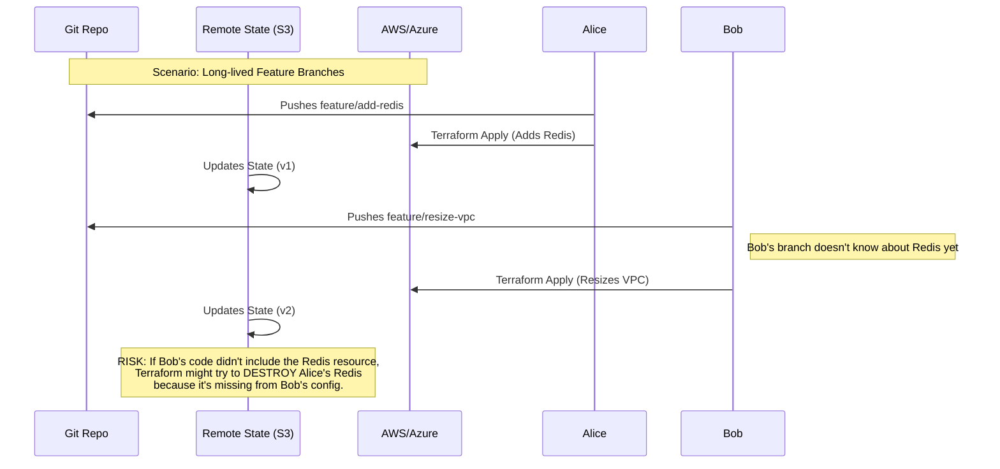
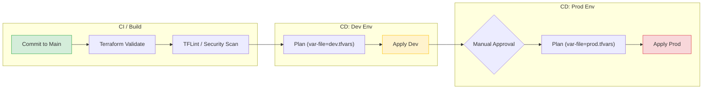

**TL;DR**

> Applying GitFlow (long-lived feature or environment branches) to Terraform often leads to "State Drift" and fragile pipelines. Unlike application code, Infrastructure as Code (IaC) has a third dimension—**State**—which cannot be merged via `git merge`.
>
> **The Winning Strategy:** Use **Trunk-Based Development**. Treat your `main` branch as the single source of truth. Use a CI/CD pipeline to promote the *same* code commit across different environments (Dev → Stage → Prod) by injecting environment-specific variables (`.tfvars`), rather than merging code between environment branches.

---

## The Core Problem: The "Third Dimension"

In standard application development, you manage two primary dimensions:

1.  **The Code:** Your logic in Git.
2.  **The Build:** The artifact running on a server.

If your code works in Git, it generally works in the build.

In Terraform, there is a third, dominant dimension: **The State** (`terraform.tfstate`).

The State is the mapping between your Git configuration and the real-world APIs of AWS/Azure/GCP. Even if you store state remotely (S3, Terraform Cloud) to prevent impossible-to-resolve JSON merge conflicts, you cannot solve **logical divergence** with Git alone.

When you use GitFlow with Terraform, you decouple the Code from the State.

## The GitFlow Trap: "State Stomping" and "Phantoms"

A common anti-pattern is mapping Git branches to environments:

*   `feature/new-db` branch deploys to a Sandbox.
*   `dev` branch deploys to Development.
*   `main` branch deploys to Production.

### The Scenario

Imagine two DevOps engineers, Alice and Bob, start working on separate features.

1.  **Alice** branches off `develop` to `feature/add-redis`. She adds a Redis cluster and deploys to the Sandbox environment to test.

2.  **Bob** branches off `develop` to `feature/resize-vpc`. He changes the VPC CIDR and deploys to the *same* Sandbox environment (or a different one).

Because Terraform tracks resources by their **address** in the state file, Alice and Bob are now in a race condition.



### The Consequence

When Alice or Bob finally merges back to `develop`, they are only merging text files. Git cannot merge the **live infrastructure state**. You now have a "clean" Git history that contradicts the messy reality of your cloud provider, creating a divergence that will likely cause a failure during the next deployment.

*   **Shared Environment Risk (State Stomping):** They stepped on each other's locks or overwrote resources because their state files were out of sync with their branches.
*   **Separate Environment Risk (Phantom Infrastructure):** If a feature branch creates resources in a dynamic environment, and the branch is deleted after merging without running a `terraform destroy`, those resources remain running in the cloud. They become "orphans"—billing you monthly but existing in no codebase.

## The Solution: Trunk-Based Development

In Trunk-Based Development (TBD), every commit to `main` is potentially deployable. You do not maintain long-lived branches.

### The Workflow

Instead of moving code between branches to promote it (e.g., merging `dev` into `prod`), you **promote the artifact**. In Terraform, the "artifact" is your module code combined with a specific commit SHA.

You use the **same code** for all environments, changing only the **input variables**.

### The Pipeline Architecture



### Practical Implementation

Structure your repository to separate logical infrastructure (the code) from environment configuration (the variables).

**Directory Structure:**

```text
/my-infra
  /modules
    /vpc
    /k8s
  main.tf          <-- The generic entry point
  variables.tf     <-- Definitions only
  config/
    dev.tfvars     <-- Dev specific values (instance_type="t3.micro")
    prod.tfvars    <-- Prod specific values (instance_type="m5.large")
```

**The CI/CD Command Logic:**

When the pipeline runs for the **Dev** stage:

```bash
# Initialize with the backend config (usually partial config)
terraform init -backend-config="bucket=my-tf-state-dev"
# Plan using the specific variables for this environment
terraform plan -var-file="config/dev.tfvars" -out=tfplan
# Apply exactly what was planned
terraform apply tfplan
```

When the pipeline promotes to **Prod**:

```bash
# Same code, different state backend, different vars
terraform init -backend-config="bucket=my-tf-state-prod"
terraform plan -var-file="config/prod.tfvars" -out=tfplan
terraform apply tfplan
```

### Why this is safer

1.  **Immutability:** The exact Terraform code that was tested in Dev is what runs in Prod. You eliminate the risk of a "bad merge" between a Dev branch and a Prod branch.
2.  **State Isolation:** Dev and Prod have completely separate state files (defined by the backend config). They never touch.
3.  **Fast Feedback:** If a commit breaks Dev, the pipeline stops. It never reaches Prod.

## The Exception: Shared Modules

There is one specific area in Terraform where **Semantic Versioning** is critical: **Shared Modules.**

If you are the "Platform Team" writing a VPC module used by 50 other application teams, you cannot rely on the "always latest" nature of Trunk-Based Development for your consumers. If you push a breaking change to `main` on your VPC module, you break 50 teams instantly.

**Strategy for Modules:**

1.  Develop the module using TBD internally (merge to `main`).
2.  When stable, tag the release using Semantic Versioning (e.g., `v1.2.0`).
3.  Consumers reference the **tag**, never the branch.

```hcl
module "vpc" {
  source = "git::https://github.com/org/terraform-aws-vpc.git?ref=v1.2.0"
  # ...
}
```

## Conclusion

Terraform is not just text; it is a remote control for expensive, stateful machinery. Treat it with the rigor of a database schema migration, not a CSS tweak.

*   **Avoid** mapping branches to environments (GitFlow).
*   **Adopt** Trunk-Based Development for root configurations.
*   **Promote** artifacts (code + vars) through pipelines, not git merges.
*   **Use** version tags only for shared library modules.

---

### Further Reading

**Terraform state & workflows**
- [Terraform Docs – State](https://developer.hashicorp.com/terraform/language/state)
- [Terraform Docs – Remote State](https://developer.hashicorp.com/terraform/language/state/remote)
- [Terraform Docs – Workspaces](https://developer.hashicorp.com/terraform/language/state/workspaces)
- [Terraform Cloud – Recommended Practices](https://developer.hashicorp.com/terraform/cloud-docs/recommended-practices)

**Branching models & Trunk-Based Development**
- [Atlassian – Trunk-Based Development](https://www.atlassian.com/continuous-delivery/continuous-integration/trunk-based-development)
- [End of Line – “GitFlow Considered Harmful”](https://www.endoflineblog.com/gitflow-considered-harmful)

**Modules & versioning**
- [Terraform Docs – Version Constraints](https://developer.hashicorp.com/terraform/language/expressions/version-constraints)
- [DevOpsCube – Terraform Module Best Practices](https://devopscube.com/terraform-module-best-practices/)