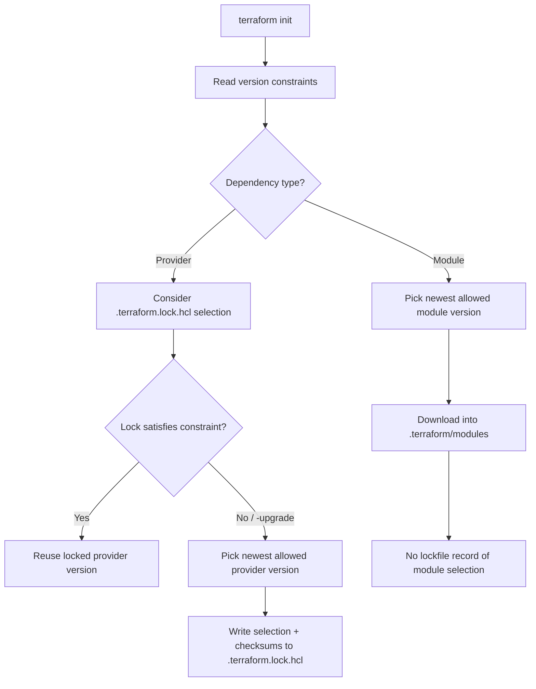

**TL;DR**

> - Treat Terraform dependency management as two different systems: providers are selected and pinned via `.terraform.lock.hcl` (repeatable by default), while modules are not pinned by a lock file and can drift over time unless you pin an exact version or a git ref.
> - Use bounded ranges for the Terraform CLI (`required_version`) and pessimistic constraints (`~>`) for providers in root modules.
> - In reusable sub-modules, prefer broad minimums (plus optional upper bounds only when necessary), letting the root module do final resolution.
> - For modules, choose explicitly between exact pins for maximum reproducibility, or `~>` ranges for easier upgrades (with disciplined `init -upgrade` workflows).

---

Specify a version constraint, run `terraform init`, done—except that **providers and modules follow different resolution and persistence rules**. Providers are locked; modules are not. That asymmetry is why teams get surprised by "nothing changed" configurations producing different results across machines or CI runs.

In this article, a **root module** means the top-level Terraform configuration you run (the directory you `init/plan/apply`). A **reusable module** means a library-style module consumed by other configurations. We'll build from the mechanics to a practical, testable policy for each.

---

## The Real Problem: "Constraints" Do Not Mean "Pins"

A version constraint is a filter over acceptable versions (e.g., `>= 5.0, < 6.0`). Terraform then chooses an actual version using its resolver rules. Terraform's constraint language and the semantics of operators (including `~>`) are documented and consistent across providers and modules.

But the persistence differs:

- **Provider selections** are recorded in `.terraform.lock.hcl` and reused by default.
- **Module selections** are not recorded in that lock file; module ranges can float as new versions are published.

**Key insight:** The same operator can yield very different stability depending on whether Terraform writes down the chosen result.

---

## A Mental Model You Can Reason About



This behavior is documented: the lock file covers **providers**, not **modules**.

---

## Operators: What They Really Buy You

Terraform supports standard comparison operators plus the pessimistic constraint `~>` ("allow changes only to the rightmost specified component", i.e., a convenient bounded range).

### How to Think About Each Operator

| Operator | Meaning (operational) | Primary risk |
| :--- | :--- | :--- |
| `=` | Hard pin | Blocks bugfix/security updates unless manually changed |
| `>=` (alone) | "Anything newer is fine" | Future breakage + drift; depends on lock behavior |
| `<` / bounded range | Explicit ceiling | Requires you to choose upgrade windows deliberately |
| `~>` | Convenient bounded range | Easy to under/over-constrain if you pick the wrong precision |

### Example Interpretations (Terraform Semantics)

- `~> 5.0` means `>= 5.0.0, < 6.0.0`
- `~> 5.0.3` means `>= 5.0.3, < 5.1.0`

---

## Root Module Policy: Reproducibility First, Upgrades by Intent

Root modules are where you want:

- Predictable CI behavior
- Stable planning across machines
- Controlled upgrades

### 1) Terraform CLI (required_version): Bounded Major

Terraform v1.x offers explicit compatibility promises, but minor releases can still include upgrade notes and non-breaking behavior changes.

**Recommended:**

```hcl
terraform {
  required_version = ">= 1.5.0, < 2.0.0"
}
```

**Trade-off analysis:**

- **Pros:** Avoids accidental major upgrade; permits minor/patch modernization.
- **Cons:** You must choose the floor; too-low floors prevent using newer language features.

### 2) Providers (required_providers): ~> at Major (or Explicit Bounded Range)

Terraform's own provider-versioning guidance warns that overly loose constraints can lead to unexpected changes, and recommends careful scoping in conjunction with the lock file.

**Recommended:**

```hcl
terraform {
  required_providers {
    aws = {
      source  = "hashicorp/aws"
      version = "~> 5.0"
    }
  }
}
```

**Why `~> 5.0` is usually the sweet spot:**

- It creates an explicit upper bound (no surprise major break).
- Within the bound, `.terraform.lock.hcl` makes runs repeatable unless you explicitly run `terraform init -upgrade`.

**When to prefer an explicit range:**

```hcl
version = ">= 5.10.0, < 5.30.0"
```

- You're in a regulated environment.
- You've validated only a subset of minors.
- You want tighter control than "any 5.x".

---

## Reusable Sub-Module Policy: Compatibility First, Narrow Only When Justified

A reusable module is a library: the consumer (root module) must be able to combine multiple modules without constraint conflicts. Terraform requires modules to declare provider requirements so a single provider version can be chosen across the module graph.

### Providers in Sub-Modules: Set Minimums, Avoid Forcing Upgrades

```hcl
terraform {
  required_providers {
    aws = {
      source  = "hashicorp/aws"
      version = ">= 4.0, < 6.0"
    }
  }
}
```

**Trade-off analysis:**

- **Pros:** Maximum compatibility; fewer "solver conflicts" for users.
- **Cons:** You must test against more provider versions (CI matrix helps).

This pattern—broad constraints in libraries, tight constraints in applications—is standard across ecosystems. OpenTofu's documentation makes the same distinction.

---

## Modules: Where Most Teams Get Surprised

Terraform strongly recommends specifying module versions, and notes that omitting version loads the latest module.

But there's a deeper point: **module selections aren't pinned by the dependency lock file.** The lock file is for providers.

This is a design choice: Terraform's dependency lock file is scoped to provider packages and their checksums. Module selection is treated as an input to `init` (resolved when modules are installed), not as a locked artifact recorded for reuse across runs.

So you must choose between two legitimate strategies:

### Strategy A: Pin Exact Module Versions (Maximum Reproducibility)

```hcl
module "vpc" {
  source  = "terraform-aws-modules/vpc/aws"
  version = "5.5.0"
}
```

**What you gain:**

- If your configuration hasn't changed, the module won't change just because time passed.

**What you pay:**

- You must bump versions intentionally (which is often good governance).

### Strategy B: Use ~> Ranges (Upgradeable by Default, but Drift Is Possible)

```hcl
module "vpc" {
  source  = "terraform-aws-modules/vpc/aws"
  version = "~> 5.0"
}
```

**What you gain:**

- Easier to consume patches/minors within the major line.

**What you pay:**

- The selected module version can change whenever `terraform init` resolves again, because there's no lockfile record.

### What "Drift" Looks Like in Practice

This is the common surprise: you haven't changed `.tf` files, but a fresh checkout (or a cleaned `.terraform/`) pulls a newer module version inside your allowed range.

Example scenario:

- You have `version = "~> 5.0"` for a registry module.
- A teammate (or CI) runs `terraform init` in a clean workspace.
- Terraform resolves to a newer `5.x` module release than you were using before.
- `terraform plan` now shows changes you didn't intend, even though your configuration didn't change.

If you want "same inputs → same plan" as the default across machines, **pin exact module versions (or a git `ref`)** and upgrade on purpose.

---

## Practical Guidance: Choosing Constraints That Match Your Workflow

### If You Want Reproducibility as the Default

- **CLI:** `>= X, < 2.0.0`
- **Providers:** `~>` at major + commit `.terraform.lock.hcl`
- **Modules:** exact versions (registry) or git `ref=` pins

### If You Want Faster Upgrades with Guardrails

- **CLI:** bounded major
- **Providers:** `~>` at major + scheduled `init -upgrade` + review lockfile diffs
- **Modules:** `~>` ranges + explicit "module upgrade" PRs + CI validation

Terraform itself recommends including the dependency lock file in version control so dependency changes are reviewable.

---

## Constraint Conflicts in Module Trees

A common failure mode in larger stacks:

- Sub-module A requires `aws < 5.0`
- Sub-module B requires `aws >= 5.10`
- Root module tries to set `aws ~> 5.0`

Terraform adheres to a strict "diamond dependency" rule: the entire graph must share a single version of any given provider. If Module A demands `aws < 5.0` and Module B demands `aws >= 5.10`, `terraform init` will fail. Broad constraints in libraries prevent these unresolvable conflicts.

---

## Takeaways

- **Treat providers and modules differently:** one is lock-pinned, the other is not.
- **In root modules,** use bounded ranges and commit `.terraform.lock.hcl`.
- **In reusable modules,** set broad minimums to avoid forcing consumers into upgrades.
- **Decide explicitly** whether you optimize for reproducibility (exact module pins) or upgrade velocity (`~>` module ranges with disciplined upgrade workflows).
- **Add CI checks that:**
  - diff `.terraform.lock.hcl`
  - run `terraform init -upgrade` on a schedule in a dedicated branch
  - validate plans across your supported provider/version matrix for reusable modules

---

## Further Reading

### Terraform Documentation

- [Terraform: Version Constraints (operators and ~>)](https://developer.hashicorp.com/terraform/language/expressions/version-constraints)
- [Terraform: Dependency Lock File (.terraform.lock.hcl)](https://developer.hashicorp.com/terraform/language/files/dependency-lock)
- [Terraform: Use Modules in Configuration (module version argument)](https://developer.hashicorp.com/terraform/language/modules/configuration)

### Tutorials & Guides

- [Terraform: Lock and Upgrade Provider Versions (tutorial)](https://developer.hashicorp.com/terraform/tutorials/configuration-language/provider-versioning)
- [Terraform Tutorial: Use Registry Modules (recommends specifying module versions)](https://developer.hashicorp.com/terraform/tutorials/modules/module-use)

### Compatibility & Upgrades

- [Terraform: Terraform v1.x Compatibility Promises](https://developer.hashicorp.com/terraform/language/v1-compatibility-promises)
- [Terraform: Upgrade Guides (examples of minor-release upgrade notes)](https://developer.hashicorp.com/terraform/language/upgrade-guides)

### Comparative Guidance

- [OpenTofu: Version Constraints (useful comparative guidance for root vs reusable modules)](https://opentofu.org/docs/language/expressions/version-constraints/)

